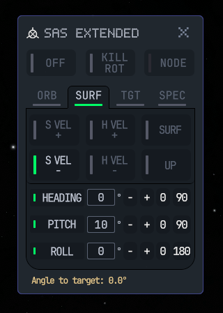
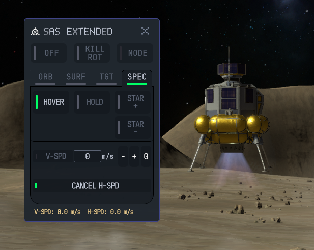

# SAS Extended - a KSP2 plugin

**A precision flight-control mod for Kerbal Space Program 2** that turns the game's stock
Stability Assist System into a full six-axis attitude autopilot — with fine-grained orientation
offsets, an inertial attitude lock, and a self-tuning powered-hover controller.

> Built on the KSP2 **Redux / SpaceWarp2** modding stack (Unity 6, C# 9). Every mode below is
> implemented, in-game tested, and shipping.
> Showcase: https://www.youtube.com/watch?v=6EF_POq78kM

---

<table>
<tr>
<td width="52%" valign="top">

### Fine attitude control

Stock SAS can only point *one axis* at a handful of preset directions and gives you no roll
control at all. SAS Extended lets you pick a **base direction** — from Orbital, Surface, Target,
or Special categories — and then dial in exact **Heading / Pitch / Roll** offsets relative to it.

Select *Surface Retrograde*, pitch up 10°, and the vessel holds that attitude for you while the
autopilot handles the torque. Each axis has a toggle: turn one off and that axis is left genuinely
free to drift, exactly like stock SAS leaves roll uncontrolled — no silent snapping to zero.

</td>
<td width="48%" valign="top">

</td>
</tr>
</table>

<table>
<tr>
<td width="48%" valign="top">

</td>
<td width="52%" valign="top">

### Powered hover

**Hover mode** does what no stock control can: it points the thrust axis up, leans into horizontal
surface velocity to null out drift, and modulates the throttle to hold a commanded vertical speed.

The throttle law is a **gravity-compensated PID controller whose integral term self-tunes to each
vessel's own hover-equilibrium throttle**, so it needs *no* thrust/mass/TWR model. The same
integral drives the tilt authority and the tilt-angle safety ceiling. It has been validated across
extremes — from featherweight low-gravity landers to high-TWR craft under heavy gravity.

</td>
</tr>
</table>

---

## Every mode

| Group | Modes |
|-------|-------|
| **Global** | `OFF` · `KILL ROT` (capture & hold current attitude) · `NODE` (point at the maneuver burn vector) |
| **Orbital** | Prograde · Retrograde · Normal ± · Radial ± |
| **Surface** | Surface Velocity ± · Horizontal Velocity ± · Surface (horizon) · Up |
| **Target** | Target ± · Relative Velocity ± · Parallel ± (e.g. align to a docking port) |
| **Special** | Star ± (point at/away from the parent star) · **HOLD** (lock attitude in inertial space) · **HOVER** |

Every pointing mode accepts the full Heading/Pitch/Roll offset trim, remembers its offsets as you
switch between modes, and shows a live status readout (angle-to-target, angular velocity, or
vertical/horizontal speed depending on mode). The window is draggable and its position, open state,
and settings persist across sessions.

---

## Engineering highlights

This is a real-time control mod that has to cooperate with a physics engine it doesn't own. Some of
the more interesting problems it solves:

- **Quaternion attitude pipeline.** All orientation is computed as full 3-axis rotations
  (`LookRotation` + Euler offset composition) and handed to the game's SAS via `LockRotation`, so
  heading, pitch, *and* roll are commanded together. Telemetry direction vectors are re-framed into
  a single coordinate system before use.

- **Slew-rate limiting for ill-conditioned setpoints.** A near-antipodal mode switch (Prograde →
  Retrograde) would otherwise hand the autopilot a 180°-flipped target in a single tick — the
  classic degenerate case for quaternion control, and a source of hard oscillation. The commanded
  setpoint is anchored to the vessel's *actual* current attitude each tick and slewed toward the
  target at a bounded rate.

- **Throttle ownership via Harmony.** The stock input handler re-pushes its own throttle every
  `FixedUpdate`, overwriting anything set from the update loop. A Harmony postfix injects the
  hover controller's commanded throttle *after* player input but *before* the push, so it sticks.

- **A testable pure-math layer.** The quaternion and hover-control math is extracted out of the
  MonoBehaviour into KSP-free pure functions.

- **Custom UI controls.** The UXML/USS interface is styled to match KSP2's own flight
  panels and registers custom UI Toolkit controls (LED toggle buttons, tab buttons) through the
  Redux control-factory registry.

## Tech stack

Unity `6000.5.0f1` · C# 9 · ReduxLib → SpaceWarp2 modding stack ·
Harmony patching · UI Toolkit (UXML/USS) · ThunderKit build pipeline · Unity Test Framework

## Building

SAS Extended builds through **ThunderKit pipelines in the Unity Editor**
(`Assets/SASExtended/Pipelines/` → *Build for Editor* / *Build for Player* / *Deploy to Zip File*),
not a plain `dotnet build`. The compiled mod stages to `Assets/Mods/__Testing/SASExtended/`.

---

Design north star: feature parity with KSP1 MechJeb2's "Smart A.S.S." module, rebuilt from the
ground up for KSP2's Redux stack. Author: **Falki**.
